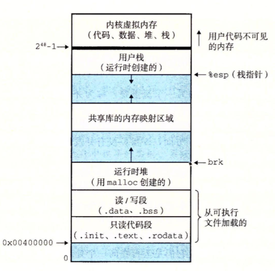

# 【笔记】ECF Exceptional Control Flow

该文章是《深入理解计算机系统》中第八章关于 ECF 的读书笔记，有大量的原文摘抄，所以本篇文章不在仓库的许可协议之内。如您想了解相关知识请积极购买正版。

## ECF

实际上就是一种反馈机制，因为处理一系列事件，并不能始终是按照预定计划进行的，当意料之外的事件发生时，如何处理呢？如何将意外事件反馈给决策者呢？这就是需要意外处理，即本章要介绍的 ECF

当子进程终止时，创建这些子进程的父进程必须得到通知。（_为什么要通知父进程呢？他们不应该是相互独立的吗？_）

为什么要理解 ECF ：

- 有助于理解操作系统概念：ECF 是操作系统用来实现 I/O、进程和虚拟内存的基本机制；
- 有助于理解应用程序与操作系统的交互：应用程序通过将使用一个叫做陷阱（trap）或者系统调用（system call）的 ECF形式，想操作系统请求服务。例如：向磁盘写数据、从网络读取数据、创建一个新进程，以及终止当前进程，都是通过应用程序调用系统调用来实现的；
- 有助于编写应用：操作系统为应用程序提供了强大的 ECF 机制，用来创建新进程、等待进程终止、通知其它进程系统中的一场时间，以及检测和响应这些时间。
- 有助于理解并发：ECF 是计算机系统中实现并发的基本机制。在运行中的并发的例子有：中断应用程序执行的异常处理程序，在时间上重叠执行的进程和线程，以及中断应用程序执行的信号处理程序。
- 有助于理解软件异常如何工作：像 try、catch、throw 等异常机制，软件异常允许程序进行非本地跳转（即违反通常的调用/返回栈规则的跳转）来响应错误情况。非本地跳转是一种应用层 ECF，在 C 中是通过 setjmp 和 longjmp 函数提供的。

## 8.1 异常

异常是异常控制流的一种形式，它一部分由硬件实现，一部分由操作系统实现。

异常（exception）就是控制流中的突变，用来响应处理状态中的某些变化。

在任何情况下，当处理器检测到有时间发生时，它就会通过一个张叫做异常表（exception table)的跳转表，进行一个间接过程调用（异常），到一个专门设计用来处理这类事件的操作系统子程序（异常处理程序（exception handler））。异常处理完毕后，根据事件的类型，会发生一下 3 种情况之一：
1. 处理程序将控制返回给正常流的当前指令Icur，即当事件发生时正在执行的指令；
2. 处理程序将控制返回给正常流的下一条指令Inext，即如果没发生异常将会执行的下一条指令；
3. 处理程序终止被中断的程序

### 8.1.1 异常处理

系统为可能发生的每中类型异常都分配了一个唯一的非负整数的异常好（exception number）。其中一部分有处理器的设计者分配，其它则有操作系统内核（操作系统常驻内存的部分）的设计者分配

CPU异常：

- 被零除
- 缺页
- 内存访问违例
- 断点
- 算数运算溢出

系统异常：

- 系统调用
- 外部 I/O 设备的信号

在系统启动时，操作系统会分配和初始化一张成为异常表（exception table）的跳转表，表目 k （exception number）包含异常 k 的处理程序的地址。

*异常表的起始地址放在一个叫做异常表基址计算器（exception table base register）的特殊 CPU 寄存器中*。

异常与过程调用不同的地方：

- 过程调用，在跳转处理程序之前，处理器将返回地址压入栈中。而异常处理是根据异常的类型，返回cur或者next指令
- 处理器会将一些额外的处理器状态压入栈中，因为在返回正常流时需要用到。
- 如果控制从用户程序转移到内核，所有这些项目都被压到内核栈中，而不是用户栈。
- 异常处理程序运行在内核模式下，这意味着他们对多有的系统资源都有完全的访问权限。

异常处理程序处理完异常事件之后，它通过执行一条特殊的“从中断返回”指令，可选地返回到被中断的程序，该指令将适当的状态弹回到处理器的控制和数据寄存器中，如果异常中断的是一个用户程序，就将状态恢复为用户模式，然后在将控制返回给被中断的程序。

### 8.1.2 异常的类别

异常分为四类：

|类别|原因|同步/异步|返回行为|
|:--|:---|:-------|:-----|
|中断（interrupt）|来自 I/O 设备的信号|异步|总是返回到下一条指令|
|陷阱（trap） |有意的异常|同步|总是返回到下一条指令|
|故障（fault）|潜在可恢复的错误|同步|可能返回到当前指令|
|终止（abort）|不可恢复的错误|同步|不会返回|

#### 中断

当网络适配器、磁盘控制器、或定时器芯片，通过向处理器芯片上的一个引脚发信号，并将异常号放到系统总线上，来触发中断，该异常号标识了引起中断的设备。

当指令完成执行后，处理器注意到中断引脚的电压变高了，就从系统总线读取异常号，然后调用适当的中断处理程序。处理程序返回时，它就讲控制返回给下一条指令。

*相当于暂停，所以返回时从下一条指令开始，而故障则相当于错误，所以返回时从当前指令开始，以重复该过程*。

#### 陷阱和系统调用

陷阱是有意的异常，是执行一条指令的结果。其最重要的用途是在用户程序和内核之间提供一个像过程一样的借口，即系统调用。

用户程序经常需要向内核请求服务，诸如：读取文件（read）、创建新进程（fork）、加载一个新程序（execve），或者终止当前进程（exit）。处理器为了这些对内核的受控访问提供了一条特殊的“syscall n” 指令，用户程序执行该指令时就会导致一个到异常处理程序的陷阱，这个处理程序解析参数，并调用适当的内核程序。

普通函数运行在用户态，用户态限制了函数可以执行的指令类型，只能访问与调用函数相同的栈；系统调用运行在内核态，内核态允许系统调用执行一些特权指令，以及访问内核栈。

#### 故障

故障是有错误情况引起的，如果故障处理程序能够修正该错误，那么会返回当前指令，再次执行。否则，处理程序返回到内核中的 abort 例程，终止引起故障的应用程序。

#### 终止

终止是由不可恢复的致命错误造成的。终止处理程序不会将控制返回给应用。而是直接返回给内核中的 abort 例程，今儿终止应用程序。（终止与故障修改失败的处理方式相同）

### 8.1.3 Linux/x86-64系统中的异常
共有256中不同的异常类型：

- 0～31号异常由Intel脚骨师定义
- 32～255号异常由操作系统定义的中断和陷阱。

## 8.2 进程

进程：一个执行中程序的实例。
上下文（个人倾向译作--环境，语境，即能提供程序运行所需的环境，类似生物生物学中的生态环境）：由程序正确运行所需的状态构成。这个状态包括存放在内存中的程序的代码和数据，它的栈、通用目的寄存器的内容、程序计数器、环境变量以及打开文件描述符的集合。

进程提供给应用程序2个关键抽象：

- 一个独立的逻辑控制流，看上去好像应用程序在独占地使用 CPU
- 一个私有的地址空间，看上去好像应用程序在独占地使用内存系统。

### 8.2.1 逻辑控制流

分时操作系统的概念，多个进程交替切换执行。

### 8.2.2 并发流

并发流（concurrent flow）：一个逻辑流的执行在时间上与另一个流重叠，这两个流被称为并发地运行。即 X 在 Y 从开始到结束这段时间开始，或 X Y 的时机互换。（其实就是运行时间片有交替的多个流）。

多个流并发地执行的一般现象被称为并发（concurrency）。

一个进程和其它进程轮流运行的概念被称为多任务（multitasking）。一个进程执行它的控制流的一部分的每一个时间段叫做时间片（time slice）。因此，多任务也成做时间分片（time slicing）。

**并发流的思想与流运行的处理器核数活着计算机数无关**

如果两个流并发地运行在不同的处理器核活着计算机上，那么我们称他们为并行流（parallel flow），他们并行地运行（running in parallel），且并行地执行（parallel excution）。

### 8.2.3 私有地址空间

在一台 n 位地址地机器上，地址空间是 2ⁿ 个可能地的集合。进程为每个程序提供它们自己的私有地址空间。

进程地址空间：



### 8.2.4 用户模式和内核模式

处理器通过某个控制寄存器的一个模式位（mode bit）来提供这种限制功能，该寄存器描述了进程当前享有的特权。

当设置了模式位时，进程就运行在内核模式中。内核模式的进程可以执行指令集中的任何指令，且可以访问系统中的任意内存位置。

未设置模式位时，进程运行在用户模式。操作指令受限，访问范围受限。可以通过系统提供的接口间接地访问内核代码和数据。

*进程初始都是用户模式，只有通过异常处理才能从用户态切换为内核态（正常情况下，否则也不会有被黑了）*

### 8.2.5 上下文切换

操作系统内核使用一种称为上下文切换（context switch）的较高层形式的异常控制流来实现多任务。该机制建立在8.1节中的异常机制之上。

内核为每个进程维持一个上下文。上下文包含内容（不全）：

- 通用目的寄存器
- 浮点寄存器 
- 程序计数器
- 用户栈
- 状态寄存器
- 内核栈
- 描述地址空间的也表
- 进程表
- 进程已打开文件的文件表

抢占当前进程，重开先前被抢占了的进程的决策，被称为调度（scheduling），由内核中称为调度器（scheduler）的代码处理。

上下文切换：

1. 保存当前进程的上下文
2. 恢复先前被抢占进程的上下文
3. 将控制传递给恢复的进程

## 8.3 系统调用错误处理

很多 C 写的函数都喜欢用 -1 表示发生错误，不知道这个传统是不是就是从 Unix 开始的。

一个处理 `fork()` 错误的例子：

``` C
	if ((pid = fork()) < 0) {
		fprintf(stderr, "fork error: %s\n", strerror(errno));
		exit(0)
	}
```

书中建议对这类处理进行包装，这个没什么说的，常用的错误肯定要包装一个通用的错误处理函数。

## 8.4 进程控制

从这里开始就是一些实操了

### 8.4.1 获取进程 ID

每个进程都有一个唯一的正数（非零）进程 ID（PID）。`getpid(void)` 返回调用进程的 PID

### 8.4.2 创建和终止进程

收到一下信号时，进程会被挂起（suspended），直至收到 SIGCONT 再次恢复运行：

- SIGSTOP
- SIGTSTP
- SIGTTIN
- SIGTTOU

进程的三个终止原因：

- 收到终止信号
- 从主程序返回，即 `main()` 函数的 `return`，也就是执行完毕
- 调用 exit 函数，主动调用退出函数

**父进程通过调用 `fork()` 函数创建一个新的运行的子进程，新创建的子进程几乎但不完全与父进程相同。子进程会得到与父进程用户级虚拟地址空间相同的（但是独立的）一份拷贝，包括代码和数据段、堆、共享库以及用户栈。还获得与父进程任何打开文件描述符相同的副本，这意味着父进程调用 `fork()` 时，子进程可以读写父进程中打开的任何文件。最大区别就是 PID 不同**。

`fork()` 调用一次，返回两次：一次在调用进程（父进程）中，它返回子进程的 PID；一次是在新创建的子进程中，它返回 0。


**下面的实例代码创建了4个进程，1->2->4**

``` C
int main() 
{
	fork();
	fork();
	printf("hello\n");
	exit(0);
}
```

### 8.4.3 回收子进程


 

