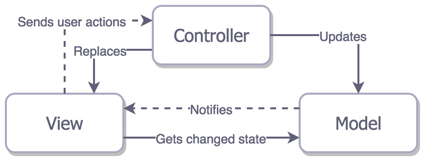
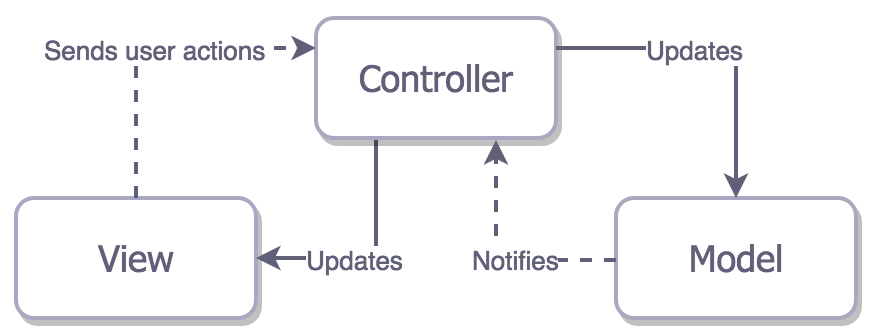
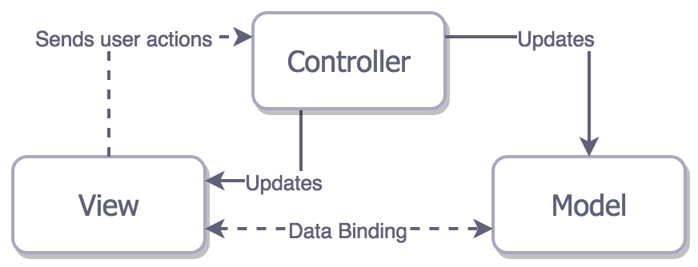
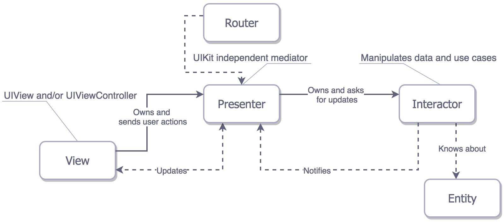

# 面试题系列之设计模式
## 1. 什么是设计模式？

《设计模式》一书中关于设计模式的定义：对定制来解决特定场景下一半设计问题的类和互相通信的对象的描述。简而言之，设计模式时为特定场景下的问题而定制的解决方案。

常见的设计模式：

- 原型模式
- 工厂方法模式
- 抽象工厂模式
- 生成器模式
- 单例模式
- 适配器模式
- 桥接模式
- 外观模式
- 中介者模式
- 观察者模式
- 组合模式
- 迭代器模式
- 访问者模式
- 装饰模式
- 责任链模式
- 模板方法模式
- 策略模式
- 命令模式
- 共享池模式
- 代理模式
- 备忘录模式

### 1.1 工厂方法模式以及抽象工厂模式？

- 工厂方法模式定义创建对象的接口，让子类决定实例化哪一个类。工厂方法是的一个类的实例化延迟到其子类。
- 抽象工厂模式提供一个固定的接口，用于创建一系列有关联和相依存的对象，而不必制定其具体类或其创建的细节。客户端与从工厂得到的具体对象之间没有耦合。

对比：

|工厂方法模式|抽象工厂模式|
|:---------|:---------|
|通过类继承创建抽象产品|通过对象组合创建抽象产品|
|创建一种产品|创建多系列产品|
|子类话创建者并冲在工厂方法以及创建新产品|必须修改父类的接口才能支持新的产品|

### 1.2 抽象工厂模式在 CocoaTouch 中的哪些类中有体现？
类簇是基础框架中一种常见的设计模式，基于抽象工厂模式的思想。它将若干相关的私有具体工厂子类集合到一个公有的抽象超类之下。

CocoaTouch 中的类簇：

- `NSNumber`
- `UIButton`

### 1.3 单例模式

```objc
+ (instancetype)sharedInstance {
    static InstanceType *instance;
    static dispatch_once_t onceToken;
    dispatch_once(&onceToken, ^{
        instance = [[InstanceType alloc] init];
    });
    return instance;
}
```

Swift 已经不需如此处理，它已经从语义上保证只被初始化一次。

## 2. 面向对象
面向对象编程（Object Oriented Programming, OOP），是一种计算机编程架构，也是目前应用最广泛的编程设计原则。OOP 的一个基本原则是计算机程序是由单个能够收到子程序作用的单元或对象组合而成。

面向对象三大特性：

- 封装性
- 继承性
- 多态性

### 2.1 面向对象设计七大原则
1. 单一职能原则（Single Responsibility Princple）
2. 里氏替换原则（Liskov Subsitution Princple）
3. 依赖倒置原则（Dependeance Inversion Princple）
4. 接口隔离原则（Interface Segregation Princple）
5. 开闭原则（Open Close Princple）
6. 迪米特发法则（Law of Demeter）

> 摘录自 [卡奴达摩专栏](https://blog.csdn.net/zhengzhb/article/category/926691)

#### 2.1.1 单一职责原则
**定义：**不要存在多于一个导致类变更的原因。**通俗的说，即一个类只负责一项职责。

**问题：**类 T 负责两个不同的职责：职责 P1，职责 P2。当由于职责 P1 需求发生改变而需要修改类 T 时，有可能会导致原本运行正常的职责 P2 功能发生故障。

**解决：**遵循单一职责原则。分别建立两个类 T1、T2，使 T1 完成职责 P1 功能，T2 完成职责 P2 功能。这样，当修改 T1 时，不会使职责 P2 发生故障风险；同理，当修改 T2 时，也不会使职责 P1 发生故障风险。

#### 2.1.2 里氏替换原则
1988年，由 MIT 的一位里性（Liskov）女士提出。如果对每一个类型为 T1 的对象 o1，都有类型 T2 的对象 o2，使得以 T1 定义的所有程序 P 在所有的对象 o1 都换成 o2 时，程序 P 的行为没有变化，那么类型 T2 是类型 T1 的子类型。

通俗地讲，即所有引用基类的地方必须能透明地使用其子类的对象。要复合这一原则，子类对基类就要只扩展，而不重写覆盖基类的实现。

#### 2.1.3 依赖倒置原则
**定义：**高层模块不应该依赖底层模块，二者都不应该依赖其抽象；抽象不应该依赖细节；细节应该依赖抽象。

**问题：**假设类 A 直接依赖类 B，如果要让 A 改为依赖类 C，那么必须修改 A 的代码。此时，如果 A 是一个高层模块，负责复杂的业务逻辑，而 B 和 C 是底层模块，负责基本的原子操作。那么修改后就会带来风险，因为 A 的业务逻辑复杂，依赖可能非常分散，而且也非常不便于测试。

**解决：**通过协议（接口）来解决。假设我们将 A 的依赖全部抽象到一个协议 P 中，那么 B、C 只要实现协议即可，以后再次发生以来更新时，只要新增一个 D 并实现 AP 协议即可，这样就大大降低了修改类 A 的几率。

#### 2.1.4 接口隔离原则
**定义：**客户端不应该依赖它不需要的接口；一个类对另一类的依赖应该建立在最小的接口上。

**问题：**类 A 通过接口 I 依赖类 B，类 C 通过接口 I 依赖类 D，如果接口 I 对于类 A 和类 B 来说不是最小接口，则类 B 和类 D 必须去实现他们不需要的方法。

**解决：**将臃肿的接口 I 拆分为独立的几个接口，类 A 和类 C 分别与他们需要的接口建立依赖关系。也就是采用接口隔离原则

#### 2.1.5 开闭原则
**定义：**一个软件实体如类、模块和函数应该对扩展开放，对修改关闭。

**问题：**在软件的生命周期内，因为变化、升级和维护等原因需要对软件原有代码进行修改时，可能会给旧代码中引入错误，也可能会使我们不得不对整个功能进行重构，并且需要原有代码经过重新测试。

**解决：**当软件需要变化时，尽量通过扩展软件实体的行为来实现变化，而不是通过修改已有的代码来实现变化。

这一条最虚，跟没说一样，具体怎么做才能做到尽量不修改，只做加法即可？现实开发中不存在不修改原有的可能，只能尽量将粒度划分的小一些，以贴合这一设计原则。

#### 2.1.6 迪米特法则
**定义：**一个对象应该对其他对象保持最少的了解。

**问题：**类与类之间的关系越密切，耦合度越大，当一个类发生改变时，对另一个类的影响也越大。

**解决：**尽量降低类与类之间的耦合

自从我们接触编程开始，就知道了软件编程的总的原则：低耦合，高内聚。无论是面向过程编程还是面向对象编程，只有使各个模块之间的耦合尽量的低，才能提高代码的复用率。低耦合的优点不言而喻，但是怎么样编程才能做到低耦合呢？那正是迪米特法则要去完成的。

迪米特法则又叫最少知道原则，最早是在1987年由美国Northeastern University的Ian Holland提出。通俗的来讲，就是一个类对自己依赖的类知道的越少越好。也就是说，对于被依赖的类来说，无论逻辑多么复杂，都尽量地的将逻辑封装在类的内部，对外除了提供的public方法，不对外泄漏任何信息。迪米特法则还有一个更简单的定义：只与直接的朋友通信。首先来解释一下什么是直接的朋友：每个对象都会与其他对象有耦合关系，只要两个对象之间有耦合关系，我们就说这两个对象之间是朋友关系。耦合的方式很多，依赖、关联、组合、聚合等。其中，我们称出现成员变量、方法参数、方法返回值中的类为直接的朋友，而出现在局部变量中的类则不是直接的朋友。也就是说，陌生的类最好不要作为局部变量的形式出现在类的内部。

## 3. 架构
架构（Architecture）

- MVC: Model-View-Controller
- MVP: Model-View-Presenter
- MVVM：Model-View-View Model
- VIPER:

> 引自：[《iOS Architecture Patterns:Demystifying MVC, MVP, MVVM and VIPER》](https://medium.com/ios-os-x-development/ios-architecture-patterns-ecba4c38de52)
> 
> 译文：[《iOS架构设计：揭秘MVC, MVP, MVVM以及VIPER》](https://www.jianshu.com/p/68aa6071c02e)

### 3.1 MVC 架构

#### 3.1.1 传统的 MVC 架构


在上图的情况下，View是无状态的。一旦Model被改变，Controller就会简单地渲染它。例如：网页完全加载后，一旦你按下链接，就导航到其他地方。
虽然在iOS应用用传统的MVC架构也可以实现，但这并没有多大意义，由于架构问题 ——三个实体是紧耦合的，每个实体和其他两个通信。这大大降低了可重用性——这可不是你希望在你的应用程序看到的

#### 3.1.2 Apple的MVC架构
**期望**



Controller是View和Model之间的中介，这样他们就解耦了。最小的可重用单元是Controller，这对我们来说是个好消息，因为我们必须有一个来放那些不适合放入Model的复杂业务逻辑的地方。

从理论上讲，它看起来很简单，但你觉得有些地方不对，对吧？你甚至听到有人说MVC全称应该改为Massive View Controller（大量的视图控制器）。此外，为View controller减负也成为iOS开发者面临的一个重要话题。

**实际**


Cocoa MVC鼓励人们编写大规模的视图控制器，而且由于它们涉及View的生命周期，所以很难说它们（View和Controller）是分离的。

虽然你仍有能力将一些业务逻辑和数据转换成Model，但你没办法将View从Controller中分离。在大多数时候所有View的责任是把事件传递给Controller

#### 3.1.3 MVC 架构的优缺点 
MVC 的优点：

- 各司其职，互不干涉：三层中某一个发生了需求变化，只需修改响应模块的逻辑可，不会影响到其它；
- 有利于开发分工：正式因为其具备互不干涉的特点，得以将开发工作分开；
- 有利于组件的重用：功能专一可以抽象成一些通用的组件，利于重用。

MVC 的缺点：

- 增加了系统结构和实现的复杂性。对于简单的界面，严格遵循MVC，使模型、视图与控制器分离，会增加结构的复杂性，并可能产生过多的更新操作，降低运行效率。
- 视图与控制器间的过于紧密的连接。视图与控制器是相互分离，但确实联系紧密的部件，视图没有控制器的存在，其应用是很有限的，反之亦然，这样就妨碍了他们的独立重用。
- 视图对模型数据的低效率访问。依据模型操作接口的不同，视图可能需要多次调用才能获得足够的显示数据。对未变化数据的不必要的频繁访问，也将损害操作性能。
- 目前，一般高级的界面工具或构造器不支持MVC模式。改造这些工具以适应MVC需要和建立分离的部件的代价是很高的，从而造成使用MVC的困难。

### 3.2 MVP 架构
MVP（Model View Presenter）架构师从著名的 MVC 架构演变而来的。虽然 MVC 很好的将 Mode 和 View 进行了分离，但是也带来一个问题，Model 的变化以及 View 的反馈，这些消息都必须经过 Controller 来进行，随着应用的开发，Controller 也就变得越来越臃肿不堪。


#### 3.2.1 MVP 架构介绍
从名字便可知，MVP 同样是三层架构：

- Model：数据层，它区别于 MVC 架构中的 Model，在这里不仅仅只是数据模型，还兼具对数据的存取操作，例如：对数据库的读写，网络的数据的请求等等；
- View：视图层，仅负责对数据的展示，提供与用户进行交互的窗口；
- Presenter：它是连接 View 与 Model 的桥梁，并对业务逻辑进行处理。在 MVP 架构中 Model 与 View 无法直接进行交互。所以在 Presenter 中，它会从 Model 层中获得所需的数据，进行适当的处理后交给 View 进行展示。这样通过 Presenter 将 View 与 Model 进行隔离，使得 View 和 Model 之间不存在耦合，同时也将业务逻辑从 View 中抽离。

#### 3.2.2 MVP 的特性评估
- 职责拆分 — 我们将最主要的任务划分到Presenter和Model，而View的功能较少（虽然上述例子中Model的任务也并不多）。
- 可测性 — 非常好，基于一个功能简单的View层，可以测试大多数业务逻辑
- 易用性 — 在我们上边不切实际的简单的例子中，代码量是MVC模式的2倍，但同时MVP的概念却非常清晰

#### 3.2.3 监听 Controller 的 MVP


### 3.3 MVVM 架构

#### 3.3.1 MVVM 介绍
MVVM架构是MV(X)系列最新的成员


它和 MVP 模式看起来很像:

- MVVM 也将 ViewController 视作 View
- 在 View 和Model 之间没有耦合

此外，它还有像 Supervising 版本的MVP那样的绑定功能，但这个绑定不是在 View 和 Model 之间而是在 View 和 ViewModel 之间

#### 3.3.2 绑定

#### 3.3.3 MVVM 的特性评估
- 职责拆分 — 在例子中并不是很清晰，但是事实上，MVVM的View要比MVP中的View承担的责任多。因为前者通过ViewModel的设置绑定来更新状态，而后者只监听Presenter的事件但并不会对自己有什么更新。
- 可测性 — ViewModel不知道关于View的任何事情，这允许我们可以轻易的测试ViewModel。同时View也可以被测试，但是由于属于UIKit的范畴，对他们的测试通常会被忽略。
- 易用性 —  在我们例子中的代码量和MVP的差不多，但是在实际开发中，我们必须把View中的事件指向Presenter并且手动的来更新View，如果使用绑定的话，MVVM代码量将会小的多。

### 3.4 VIPER 架构

#### 3.4.1 VIPER 架构介绍



- 交互器（Interactor） — 包括关于数据和网络请求的业务逻辑，例如创建一个实体（Entities），或者从服务器中获取一些数据。为了实现这些功能，需要使用服务、管理器，但是他们并不被认为是VIPER架构内的模块，而是外部依赖。
- 展示器（Presenter） — 包含UI层面（但UIKit独立）的业务逻辑以及在交互器（Interactor）层面的方法调用。
- 实体（Entities） — 普通的数据对象，不属于数据访问层，因为数据访问属于交互器（Interactor）的职责。
- 路由器（Router） — 用来连接VIPER的各个模块。

#### 3.4.2 VIPER 与 MVX 对比
- Model（数据交互）逻辑以实体（Entities）为单位拆分到交互器（Interactor）中。
- Controller/Presenter/ViewModel 的UI展示方面的职责移到了Presenter中，但是并没有数据转换相关的操作。
- VIPER 是第一个通过路由器（Router）实现明确的地址导航的模式。


