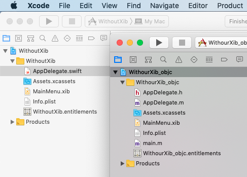

# macOS 项目的纯代码启动

很少触及 macOS 上的开发，即使偶尔小试也都是通过 xib，或者 Storyboard 来启动，今天在测试 OpenGL 代码时突发奇想，怎么像在 iOS 上一样通过纯代码启动应用呢？

> 这里用“启动”这个词不太准确，因为此时 `main` 已经被调用了，只是默认走的 Xib 或 Storyboard 入口（entry point）。但如果叫“入口”，恐怕哪些真正需要了解文章内容的朋友又检索不到了。

## 创建项目

首先创建一个 macOS 项目，跟着提示一步一步往下走即可。有一点要说明，如果在创建时没有勾选 Storyboard，那么 Xcode 会默认给你创建一个 xib（就是被这点给养懒了）。

创建完毕后，我们先来看看工程结构，如下图所示。



可以看到，无论是选择 Swift 还是 Objective-C，两个项目的结构基本是一致的。唯一的区别就是 Swift 项目中没有相应的 `main.swift` 文件。我们打开 `AppDeleagte` 文件，可以看到除了 Swift 文件中多了一个“注解” `@NSApplicationMain`，其它全部相同（Swift 官方文档称之为“（属性）Attribute”）。

事实上正是这句“注解”起到了 Objective-C 项目中 `main.m` 文件的 作用，可以把它看过一个语法糖，编译器在解析到此时，会自动帮我们创建一个 main 文件。 

既然讨论到是纯代码项目，那么自然 xib 也不能有，果断删除。此时运行一下看看。虽然能编译成功，但是应用直接闪退了。单纯的删除 xib 看来是不行的，还需要进一步的设置。那么怎么解决呢？

## 修复

打开 console 先看看错误提示：

```shell
2019-08-04 14:09:05.357789+0800 WithoutXib[4143:396195] Unable to load nib file: MainMenu, exiting
```
“找不到 nib 文件”，嗯，显然 xib 文件虽被删除，但是某一处依然在引用它。回想一下 iOS 的设置，当我们要纯代码项目时，除了删除 xib，还要取消 `Main Interface` 对它的引用。打开项目的通用设置，找到 “Deployment Info”，将其中对 `MainMenu` 的引用删除。再次运行，发现项目已经可以运行了，但是什么窗口都没有。（也可直接编辑“info.plist”文件）

接下来，我们看看如何通过代码创建一个窗口。

## 创建窗口

再次打开 `AppDelegate` 文件，更新为如下内容：

```swift
import Cocoa

@NSApplicationMain
class AppDelegate: NSObject, NSApplicationDelegate {

    let mainWindow: NSWindow = {
        let window = NSWindow(contentRect: NSMakeRect(0, 0, 640, 480),
                         styleMask: [.titled, .resizable, .miniaturizable, .closable, .fullSizeContentView],
                         backing: .buffered,
                         defer: false)
        window.minSize = NSMakeSize(320, 240)
        window.center()
        
        return window
    }();


    func applicationDidFinishLaunching(_ aNotification: Notification) {
        
        mainWindow.makeKeyAndOrderFront(nil);
        mainWindow.title = "Main Window Without Xib"
    }

    func applicationWillTerminate(_ aNotification: Notification) {
        // Insert code here to tear down your application
    }
}
```

再次运行。还没有窗口出现？别急，在我们创建窗口的代码上打个断点，运行，发现根本就没有走这里。怎么回事呢？

## 再次修复

如果开始创建的是 Objective-C 项目的话，到这里可能解决起来要简单些，因为打开 `main` 文件就会发现：

```objc
int main(int argc, const char * argv[]) {
    return NSApplicationMain(argc, argv);
}
```

这里好像跟我们的 `AppDelegate` 没什么关系，在回想下 iOS 的 `main` :

```objc
int main(int argc, char * argv[]) {
    @autoreleasepool {
        return UIApplicationMain(argc, argv, nil, NSStringFromClass([AppDelegate class]));
    }
}
```
这里我们有指定 AppDelegate。看来问题就在这里了。问题定位到了，可是 Swift 没有 main 文件怎么办，没有就创建一个。内容如下：

```swift
import AppKit

let app: NSApplication = NSApplication.shared()
let appDelegate = AppDelegate()
app.delegate = appDelegate
_ = NSApplicationMain(CommandLine.argc, CommandLine.unsafeArgv)
```

> 注意，自己手动添加 main 文件后，原来 AppDelegate 中的注解必须删除或注释掉，否则会提示错误。

再次运行，阔别已久的窗口终于又出现了。


## 参考

- [What does “@UIApplicationMain” mean?
](https://stackoverflow.com/questions/24516250/what-does-uiapplicationmain-mean)


